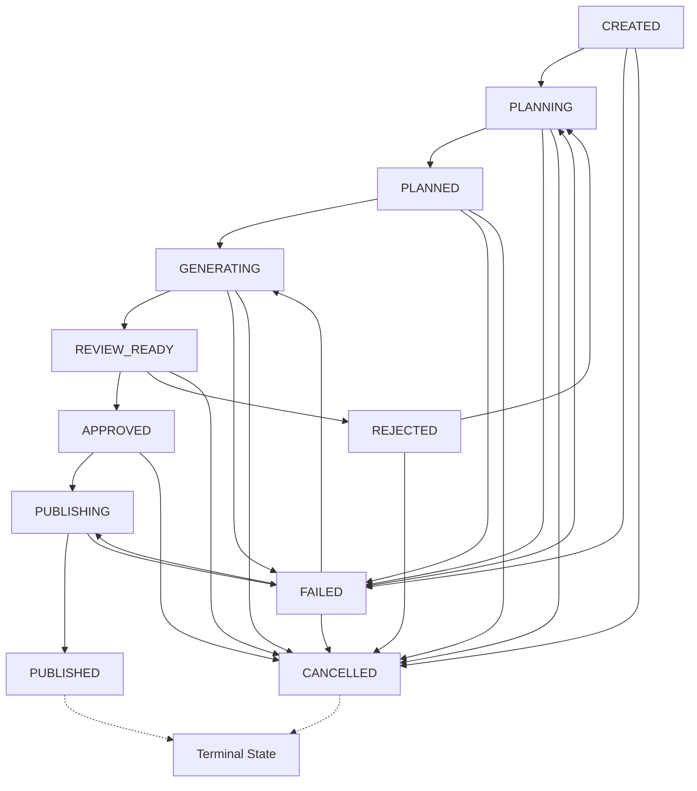

# Loredotexe Phase 1: Core Orchestration, Persistent State & Workflow Reliability

## 1. Overview & Architecture

**Phase 1** establishes the persistent state management, lifecycle state machine, idempotent execution tracking, and n8n orchestration bridge for the **Loredotexe** pipeline.

```
+-----------------------------------------------------------------------------------+
|                                 n8n Orchestrator                                  |
|                             (http://localhost:5678)                               |
+-----------------------------------------------------------------------------------+
                                         |
                                         | HTTP (JSON / REST API)
                                         v
+-----------------------------------------------------------------------------------+
|                        Loredotexe Local State Service                             |
|                           (http://127.0.0.1:3000)                                 |
+-----------------------------------------------------------------------------------+
|  * REST Endpoints (CRUD, Transitions, Executions)                                 |
|  * Strict Validation & State Machine Allowlist                                    |
|  * Optimistic Concurrency Locking (version increment)                             |
|  * Idempotency & Conflict Detection Engine                                        |
+-----------------------------------------------------------------------------------+
                                         |
                                         | Parameterized SQL (node:sqlite)
                                         v
+-----------------------------------------------------------------------------------+
|                        Persistent SQLite Store (WAL Mode)                         |
|                           (./data/loredotexe.sqlite)                              |
+-----------------------------------------------------------------------------------+
|  * projects (Lifecycle state, inputs, metadata, version)                          |
|  * executions (Operation trace, status, attempt number, error codes)              |
|  * schema_migrations (Version tracking)                                           |
+-----------------------------------------------------------------------------------+
```

---

## 2. Project Lifecycle & State Machine

Every project progresses through strict, validated lifecycle states. Unallowable jumps and stale version updates are rejected immediately.



### State Definitions

| Status | Description | Allowed Next States |
|---|---|---|
| `CREATED` | Project created and input validated; ready for planning | `PLANNING`, `FAILED`, `CANCELLED` |
| `PLANNING` | Researching lore and structuring 10-minute scene outline | `PLANNED`, `FAILED`, `CANCELLED` |
| `PLANNED` | Script and scene breakdown completed | `GENERATING`, `FAILED`, `CANCELLED` |
| `GENERATING` | Voice synthesis (Edge-TTS) and FFmpeg visual assembly in progress | `REVIEW_READY`, `FAILED`, `CANCELLED` |
| `REVIEW_READY` | Video rendered; pending human editorial review | `APPROVED`, `REJECTED`, `CANCELLED` |
| `APPROVED` | Approved by human review for publishing | `PUBLISHING`, `CANCELLED` |
| `REJECTED` | Rejected in review; returned to `PLANNING` for revision | `PLANNING`, `CANCELLED` |
| `PUBLISHING` | YouTube metadata generation and video upload in progress | `PUBLISHED`, `FAILED` |
| `PUBLISHED` | Successfully published on YouTube (**Terminal**) | None |
| `FAILED` | An error occurred; recoverable to prior stage | `PLANNING`, `GENERATING`, `PUBLISHING`, `CANCELLED` |
| `CANCELLED` | Aborted by user (**Terminal**) | None |

---

## 3. Database Schema

The persistent database uses **SQLite 3** via Node.js native `node:sqlite` with WAL mode and foreign key enforcement enabled.

### Table: `projects`
- `id` (`TEXT PRIMARY KEY`): UUID v4 identifier.
- `title` (`TEXT NOT NULL`): Video title (3–200 characters).
- `topic` (`TEXT NOT NULL`): Subject/lore topic (2–500 characters).
- `channel_name` (`TEXT NOT NULL DEFAULT 'The 10min Explosion'`): Target channel.
- `status` (`TEXT NOT NULL`): Current lifecycle state.
- `input_json` (`TEXT NOT NULL`): Original validated input payload.
- `metadata_json` (`TEXT NOT NULL DEFAULT '{}'`): Additional structured metadata.
- `error_message` (`TEXT`): Sanitized error summary if failed.
- `created_at` (`TEXT NOT NULL`): ISO 8601 UTC creation timestamp.
- `updated_at` (`TEXT NOT NULL`): ISO 8601 UTC last update timestamp.
- `started_at` (`TEXT`): Timestamp when `PLANNING` was initiated.
- `completed_at` (`TEXT`): Timestamp when `PUBLISHED` or `CANCELLED`.
- `version` (`INTEGER NOT NULL DEFAULT 1`): Optimistic concurrency version counter.

### Table: `executions`
- `id` (`TEXT PRIMARY KEY`): UUID v4 identifier.
- `project_id` (`TEXT NOT NULL`): Foreign key referencing `projects(id)` (`ON DELETE CASCADE`).
- `operation` (`TEXT NOT NULL`): Operation name (e.g., `create_project`, `generate_script`).
- `status` (`TEXT NOT NULL`): `running`, `succeeded`, `failed`, or `cancelled`.
- `attempt_number` (`INTEGER NOT NULL DEFAULT 1`): Retry attempt number.
- `idempotency_key` (`TEXT UNIQUE`): Unique token preventing duplicate executions.
- `started_at` (`TEXT NOT NULL`): Operation start timestamp.
- `finished_at` (`TEXT`): Completion timestamp.
- `error_code` (`TEXT`): Machine-readable error code.
- `error_message` (`TEXT`): Sanitized error message.
- `result_json` (`TEXT`): Structured operation output.

---

## 4. REST API Reference (Localhost 127.0.0.1:3000)

### 1. Health Check
`GET /health`
```json
{
  "status": "ok",
  "app": "loredotexe",
  "env": "development",
  "timestamp": "2026-10-05T00:30:00.000Z"
}
```

### 2. Create Project (Idempotent)
`POST /api/projects`
**Headers**: `Content-Type: application/json`, `Idempotency-Key: <optional-key>`
**Body**:
```json
{
  "title": "The Fall of Cybertron: Complete Timeline",
  "topic": "Transformers Cybertronian Great War lore",
  "channelName": "The 10min Explosion",
  "idempotencyKey": "demo-cybertron-001",
  "metadata": { "targetDuration": 600 }
}
```
**Response (`201 Created`)**:
```json
{
  "project": {
    "id": "e9d6d847-75f8-4107-b35c-dc806a6c2f9d",
    "title": "The Fall of Cybertron: Complete Timeline",
    "topic": "Transformers Cybertronian Great War lore",
    "channelName": "The 10min Explosion",
    "status": "CREATED",
    "version": 1,
    "createdAt": "2026-10-05T00:30:00.000Z",
    "updatedAt": "2026-10-05T00:30:00.000Z"
  }
}
```

### 3. Transition Project Status
`POST /api/projects/:id/transition`
**Body**:
```json
{
  "targetStatus": "PLANNING",
  "expectedVersion": 1,
  "metadata": { "researchModel": "ollama-llama3" }
}
```
**Response (`200 OK`)**:
```json
{
  "project": {
    "id": "e9d6d847-75f8-4107-b35c-dc806a6c2f9d",
    "status": "PLANNING",
    "version": 2,
    "startedAt": "2026-10-05T00:30:05.000Z"
  }
}
```

### 4. Fetch Project Details
`GET /api/projects/:id`

### 5. List Projects
`GET /api/projects?status=PLANNING&limit=10&offset=0`

### 6. Get Project Execution History
`GET /api/projects/:id/executions`

---

## 5. Running and Testing

### Initialize SQLite Database
```powershell
npm run db:init
```

### Run Test Suite (18 Automated Unit & Integration Tests)
```powershell
npm test
```

### Run Phase 1 Verification Suite
```powershell
npm run verify
```

### Start the Local Project-State API Server
```powershell
npm run server
```

---

## 6. How to Import and Run the n8n Workflow

1. Start the project-state server in a terminal:
   ```powershell
   npm run server
   ```
2. Start n8n in another terminal:
   ```powershell
   npx n8n
   ```
3. Open `http://localhost:5678` in your browser.
4. Click **Workflows** -> **Import from File...** -> Select [`workflows/phase-1-project-orchestrator.json`](file:///e:/Personal%20Projects/Loredotexe/workflows/phase-1-project-orchestrator.json).
5. Click **"Execute Workflow"**.
6. Observe the project being created idempotently, validated, transitioned to `PLANNING`, and confirmed. Re-running the workflow demonstrates idempotent deduplication without duplicate database insertion.

---

## 7. Safe Backup & Recovery

Because SQLite is operating in WAL mode:
- **Do not** blindly copy `.sqlite` files while writes are active.
- Use the built-in backup utility in `src/db/connection.js` (`backupDatabase(db, backupPath)`), which uses SQLite's transactionally safe `VACUUM INTO` command.
- The `data/*.sqlite` files are excluded from Git to prevent repository bloat and lock file conflicts.
