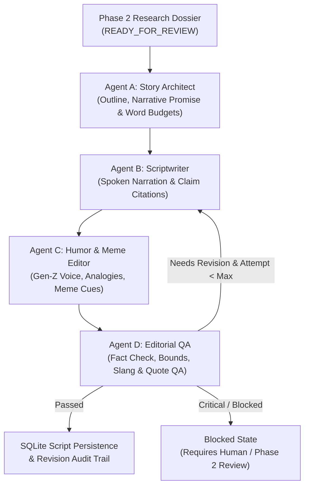
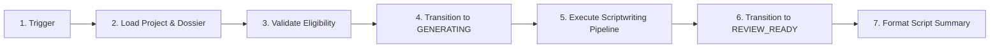

# Phase 3 — Scriptwriting, Story Architecture, Gen-Z Humor and Editorial QA

## 1. Overview

Phase 3 transforms validated Phase 2 Research Dossiers into compelling, approximately ten-minute YouTube narration scripts tailored for the channel **"The 10min Explosion"**.

It implements four modular logical agents, strict deterministic factual traceability, internet-literate Gen-Z humor adaptation, runtime estimation, automated Editorial QA, and immutable SQLite revision tracking.



---

## 2. Agent Architecture

### Agent A: Story Architect (`StoryArchitect`)
- **Central Question & Narrative Promise**: Defines a core curiosity gap grounded directly in verified claims.
- **Dynamic 7-Chapter Outline**:
  1. `ch-01-hook`: The Glitch in the Matrix (High stakes hook & curiosity gap)
  2. `ch-02-background`: Before the Chaos Began (Essential lore & context before technical depth)
  3. `ch-03-catalyst`: The Incident That Changed Everything (Milestone event with timeline citations)
  4. `ch-04-mechanism`: How It Actually Works (Simplified mechanics with analogies)
  5. `ch-05-controversy`: The Great Debate & Wild Theories (Explores competing interpretations while preserving uncertainty)
  6. `ch-06-reality-check`: Fact vs Fiction (Hard evidence vs internet speculation)
  7. `ch-07-takeaway`: The Final Verdict (Fulfills opening promise with a lasting punchline)
- **Word Budgeting**: Computes chapter word targets matching ~10 minutes (default $\sim 1450$ words at 145 wpm).
- **Title Generation**: Produces 3–5 high-CTR, click-worthy candidate titles.

### Agent B: Scriptwriter (`Scriptwriter`)
- **Grounded Spoken Narration**: Writes natural, spoken sentences without dense jargon.
- **Factual Traceability**: Explicitly binds every material factual sentence to its `claim_id`.
- **Chronology & Causality**: Preserves timeline order and causal links from the dossier.
- **Zero Hallucination Rule**: Strictly forbids fabricating quotes, statistics, or events.

### Agent C: Humor & Meme Editor (`HumorEditor`)
- **Channel Voice**: Energetic, sarcastic, internet-literate Gen-Z voice.
- **Humor Annotations**: Structured records detailing joke type (`sarcasm`, `irony`, `analogy`, `punchline`, `exaggeration`), location hints, and related claim IDs.
- **Meme Suggestions**: Recommends formats (e.g. "This is fine", "Confused Nick Young") with rights-safe original recreation notes and durations.
- **Visual Scene Suggestions**: Lower thirds, 3D animated cards, and motion graphic cues.

### Agent D: Editorial QA (`EditorialQa`)
- **Deterministic Verification Rules**:
  1. *Broken Claim Detection*: Confirms every referenced `claim_id` exists in the dossier (Critical $\to$ Blocked).
  2. *Unsupported Direct Quotations*: Flags ungrounded quotes (Critical $\to$ Blocked).
  3. *Disputed Claim Qualification*: Ensures disputed claims include uncertainty framing (Critical $\to$ Blocked).
  4. *Runtime Pacing Bounds*: Flags scripts below minimum ($< 480\text{s}$) or above maximum ($> 720\text{s}$).
  5. *Filler & Repetition*: Detects excessive repetition of filler words ("literally", "bro", "insane").
  6. *Slang Overload*: Flags forced or nonsensical slang ("skibidi", "rizzler", "sigma").
- **Scoring & Status**: Assigns score (0–100) and status (`APPROVED_FOR_REVIEW`, `NEEDS_REVISION`, `BLOCKED`).

---

## 3. Database Schema & Revision Audit

Migration [003_scripts.sql](file:///e:/Personal%20Projects/Loredotexe/src/db/migrations/003_scripts.sql) defines two tables:

### Table `scripts`
| Column | Type | Description |
|---|---|---|
| `id` | `TEXT PRIMARY KEY` | UUID v4 script package identifier |
| `project_id` | `TEXT NOT NULL` | FK to `projects.id` |
| `dossier_id` | `TEXT` | FK to `research_dossiers.id` |
| `version` | `INTEGER` | Script version number (1, 2, ...) |
| `topic` | `TEXT` | Video topic |
| `spoken_word_count` | `INTEGER` | Word count excluding stage cues |
| `estimated_duration_seconds` | `REAL` | Calculated duration in seconds |
| `approval_status` | `TEXT` | `APPROVED_FOR_REVIEW` \| `NEEDS_REVISION` \| `BLOCKED` |
| `qa_score` | `REAL` | QA Score (0–100) |
| `script_json` | `TEXT` | Full validated JSON script package |
| `content_hash` | `TEXT` | SHA-256 hash of script text + claim citations |

### Table `script_revisions`
Audit log recording every revision attempt, QA outcome, revision reason, and content hash.

---

## 4. Local REST API Endpoints

| Method | Path | Description |
|---|---|---|
| `POST` | `/api/scriptwriting/generate` | Generates full script package from dossier or project ID |
| `POST` | `/api/scriptwriting/validate` | Validates script schema and executes Editorial QA |
| `GET` | `/api/projects/:id/script` | Returns active script package for project |
| `GET` | `/api/projects/:id/scripts` | Returns revision history and audit trail |

---

## 5. n8n Workflow Integration

Workflow file: [workflows/phase-3-scriptwriting.json](file:///e:/Personal%20Projects/Loredotexe/workflows/phase-3-scriptwriting.json)



---

## 6. Test Suite & Verification Commands

### Run Full Test Suite (Phase 1, 2, and 3):
```powershell
npm test
```

### Run Phase 3 Verification Suite:
```powershell
npm run verify:phase-3
```

---

## 7. Known Limitations & Phase 4 Handoff

1. **Deterministic Test Mode**: The system runs out-of-the-box in 100% free, deterministic mode with zero external dependencies. Optional local Ollama or free Gemini/Groq APIs can be enabled via environment variables (`RESEARCH_LLM_PROVIDER`).
2. **Phase 4 Readiness**: The output package includes structured chapters, full narration, timestamp estimates, and visual cues, providing the exact input contract required for Phase 4 storyboard generation, voice synthesis, and scene prompting.
