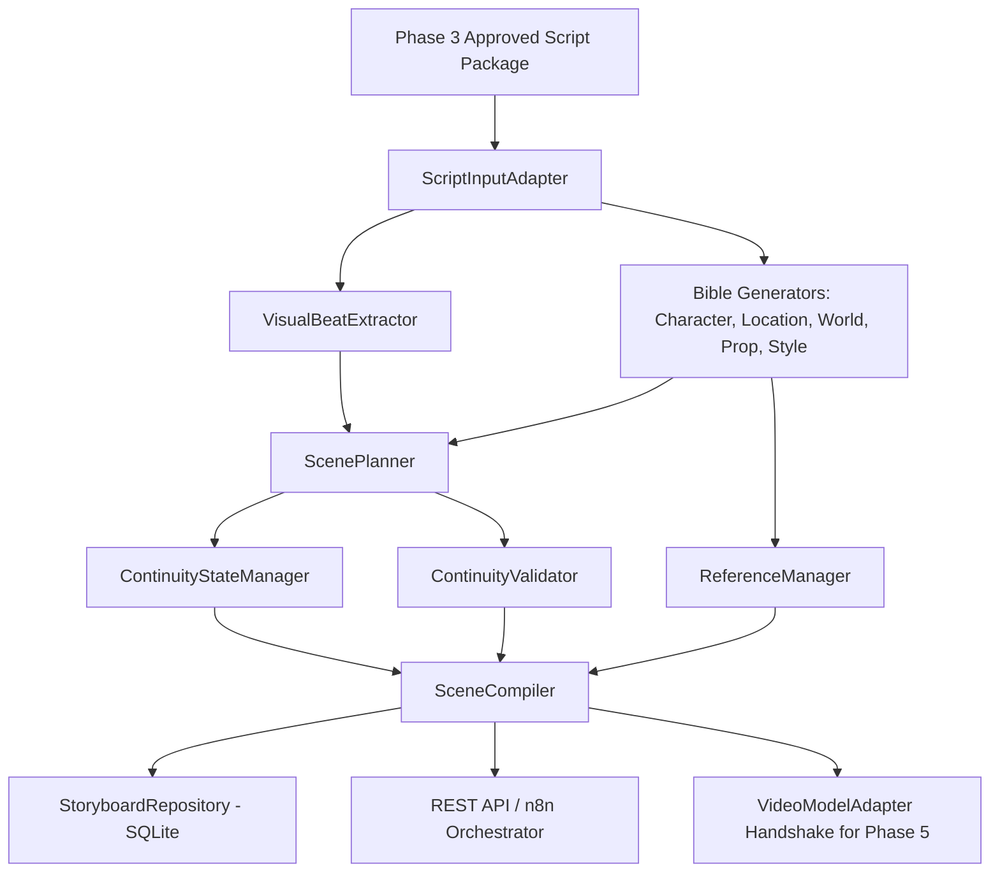

# Loredotexe — Phase 4 Architecture & Design Specification
## Storyboard, Character/World/Location Bibles, and Continuity Engine

### 1. Architectural Philosophy
Phase 4 bridges the textual and structural narrative from Phase 3 into a model-independent, canonical visual storyboard package ready for downstream rendering in Phase 5.

Key architectural pillars:
1. **Model Independence**: Storyboards generate high-detail canonical scene specifications (`visual_prompt`, `negative_prompt`, camera angles, lighting schemes, character actions, and continuity state) completely decoupled from specific AI image/video generators.
2. **Deterministic Entity Stability**: Character IDs (`CHAR_001`, `CHAR_002`), outfit IDs (`OUTFIT_001`, `OUTFIT_002`), location IDs (`LOC_001`, `LOC_002`), and prop IDs (`PROP_001`, `PROP_002`) remain stable across scenes.
3. **Rigorous Continuity Graph**: Every scene explicitly references preceding and subsequent scene IDs, tracks time of day, outfit states, and location environments.
4. **Zero-Budget & Local Execution**: Entire engine runs locally via Node.js and SQLite without paid APIs or external video generation models.

---

### 2. Component Pipeline

---

### 3. Module Breakdown

- **`ScriptInputAdapter`** (`src/storyboard/adapters/script-input-adapter.js`): Ingests and normalizes Phase 3 scripts, extracting core narrative chapters, humor annotations, and factual claims.
- **`VisualBeatExtractor`** (`src/storyboard/extractors/visual-beat-extractor.js`): Decomposes chapter narrations into visual storytelling beats strictly bounded between 4.0s and 10.0s.
- **`BibleGenerators`** (`src/storyboard/bibles/`):
  - `CharacterBibleGenerator`: Produces stable visual identities, facial traits, body types, and outfit variations.
  - `LocationBibleGenerator`: Generates architectural layouts, atmospheric lighting, and environment parameters.
  - `WorldBibleGenerator`: Establishes world rules, era settings, technology levels, and physics boundaries.
  - `PropBibleGenerator`: Generates key physical items with surface markings and continuity constraints.
  - `StyleBibleGenerator`: Encapsulates "The 10min Explosion" high-contrast dark mode neon aesthetic.
- **`ScenePlanner`** (`src/storyboard/planners/scene-planner.js`): Converts beats into canonical scenes with shot types, camera movements, actions, self-contained visual prompts, and negative constraints.
- **`ContinuityStateManager`** & **`ContinuityValidator`** (`src/storyboard/continuity/`): Deterministically tracks and verifies sequence links, entity IDs, outfit changes, and timing bounds.
- **`ReferenceManager`** (`src/storyboard/references/reference-manager.js`): Generates prioritized asset requirement manifests for Phase 5 reference generation.
- **`SceneCompiler`** (`src/storyboard/compiler/scene-compiler.js`): Aggregates all components into a validated canonical JSON package with SHA-256 content hashing.
- **`VideoModelAdapter`** (`src/storyboard/adapters/video-model-adapter.js`): Handshake interface translating canonical scenes to Wan2.1, AnimateDiff, and ComfyUI targets.
