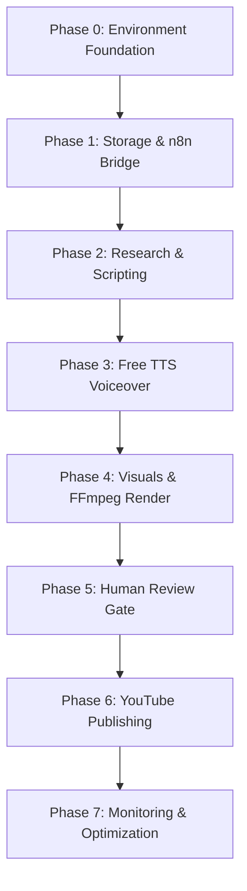

# Loredotexe Phase Roadmap & Lifecycle Strategy

This document defines the sequential development phases for the **Loredotexe** automated video production pipeline for the YouTube channel **"The 10min Explosion"**.

---

## 1. Project Phase Breakdown

---

### Phase 0: Environment Foundation *(Current Phase)*
- **Objective**: Establish repository structure, static checks, configuration templates, security boundaries, and environment verification tooling.
- **Deliverables**:
  - Verification scripts: `scripts/check-environment.ps1`, `scripts/check-n8n.ps1`
  - Clean repository baseline with security-first `.gitignore` and `.env.example`
  - Core documentation (`architecture.md`, `setup-windows.md`, `phase-roadmap.md`, `security.md`)
  - Validated `config/app.config.example.json`
- **Gate Criteria**: All Phase 0 acceptance tests pass; zero unauthorized downloads or secret leaks.

---

### Phase 1: Local Orchestration Bridge & Storage Scaffold
- **Objective**: Establish local folder structure (`storage/temp`, `storage/output`), test n8n webhook triggers, and verify local subprocess execution from n8n nodes.
- **Deliverables**:
  - Storage directory manager script
  - Base n8n health-check workflow
  - Test payload routing between local filesystem and n8n nodes.
- **Gate Criteria**: n8n successfully creates and reads files in `storage/` without permissions errors.

---

### Phase 2: Content Research & Script Generation
- **Objective**: Implement research gathering and 10-minute lore script drafting using free-tier / local LLMs.
- **Deliverables**:
  - Prompt templates for narrative pacing, chapter milestones, and scene breakdown.
  - Script output parser converting raw LLM output into structured scene JSON with visual descriptions and narrator lines.
- **Gate Criteria**: Generates consistent 10-minute scripts (~1,300–1,600 words) formatted as structured scene objects.

---

### Phase 3: Free Neural Voiceover & Subtitle Synthesis
- **Objective**: Integrate `edge-tts` (or local `piper`) to generate high-fidelity audio narration and synchronized subtitle files.
- **Deliverables**:
  - Audio generation script utilizing Microsoft Edge neural speech synthesis (free, no API key).
  - Word-level / scene-level subtitle alignment (`.srt` / `.vtt`).
  - Audio normalization and pause-trimming logic.
- **Gate Criteria**: Generates clear, synchronized audio track and subtitle file for full script with zero API spend.

---

### Phase 4: Visual Asset Sourcing & FFmpeg Video Assembly
- **Objective**: Automate visual selection (free stock media / prompt-driven imagery) and assemble final 1080p MP4 via FFmpeg.
- **Deliverables**:
  - Asset fetcher (Pexels / Pixabay free APIs / generative image endpoints).
  - FFmpeg rendering pipeline (Ken Burns pan/zoom effects, subtitle overlay, audio mixing).
  - NVENC hardware acceleration profile for NVIDIA GPUs.
- **Gate Criteria**: FFmpeg successfully renders complete 1080p 30fps MP4 video under 10 minutes with synchronized audio.

---

### Phase 5: Human-in-the-Loop Review & Approval Gate
- **Objective**: Ensure that no video is published without explicit editorial sign-off.
- **Deliverables**:
  - Local review webhook / notification workflow (discord webhook / email / local HTML viewer).
  - Approval/Rejection interactive action nodes.
  - Re-generation or edit overrides for rejected scenes.
- **Gate Criteria**: The pipeline halts automatically before upload until a human marks the production as "APPROVED".

---

### Phase 6: YouTube Publishing & Metadata Automation
- **Objective**: Automate video upload, thumbnail attachment, and metadata dispatch via Google YouTube Data API v3.
- **Deliverables**:
  - OAuth2 credential management in local n8n.
  - YouTube upload workflow setting title, description, tags, category, and initial privacy state (`Private`/`Unlisted`).
  - Optional Google Drive asset archival.
- **Gate Criteria**: Automated upload of approved video to the channel with correct metadata and private visibility.

---

### Phase 7: Performance Optimization & Resilience
- **Objective**: Automated cleanup of temporary files, retry logic, error alerting, and execution metrics.
- **Deliverables**:
  - Storage retention & garbage collection script.
  - Error notification handler.
- **Gate Criteria**: System can process back-to-back runs without exhausting disk space.

---

## 2. Strategic Hardware Decisions & Model Deferrals

> [!IMPORTANT]
> **Decision to Defer Heavy Local Video Models**:
> Due to the system's current free disk space (`< 30 GB`) and 16 GB RAM profile, running heavy local text-to-video diffusion models (e.g., Stable Video Diffusion, CogVideoX, AnimateDiff) locally is **strictly deferred**. These models require 20–60 GB of model weights and significant VRAM overhead.
>
> **Alternative Strategy**:
> - Use free stock footage APIs (Pexels, Pixabay) with dynamic FFmpeg motion effects (pan/zoom/transitions).
> - Use lightweight cloud image generation or zero-cost APIs for static visuals, animated via FFmpeg.

---

## 3. Unverified Assumptions & Risk Registry

| Item / Assumption | Status | Impact | Verification Plan |
|---|---|---|---|
| **NVIDIA GPU Model & VRAM** | Unverified | Determines NVENC encoder support & local model feasibility | Execute `scripts/check-environment.ps1` to capture `nvidia-smi` details |
| **Exact Free Disk Space** | Unverified | Influences maximum video render buffer size | Run `scripts/check-environment.ps1` to inspect exact available gigabytes |
| **Pre-installed n8n Version** | Unverified | Determines node compatibility | Verify via `scripts/check-n8n.ps1` |
| **FFmpeg Availability** | Unverified | Required for Phase 4 rendering | Verified during environment check |
| **YouTube API Quota limits** | Estimated | 10,000 units/day free quota (~6 video uploads/day) | Sufficient for planned weekly release schedule |
